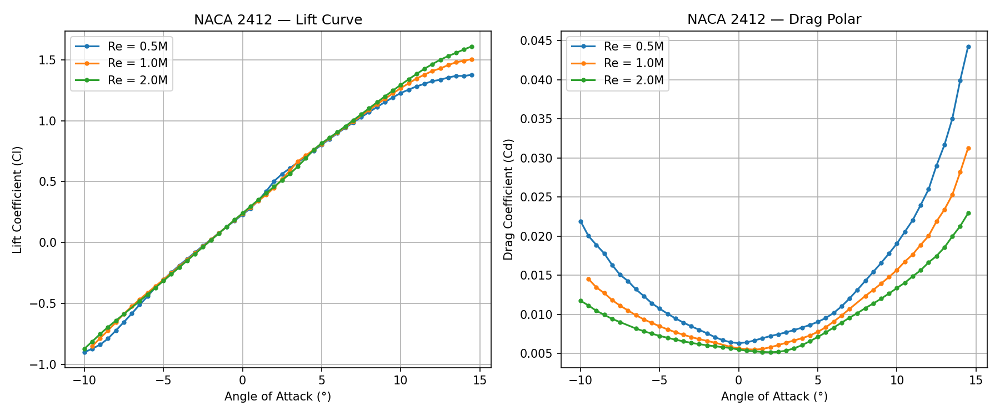
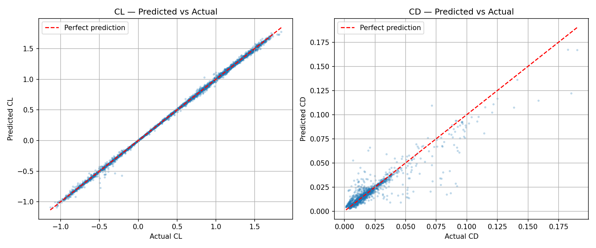
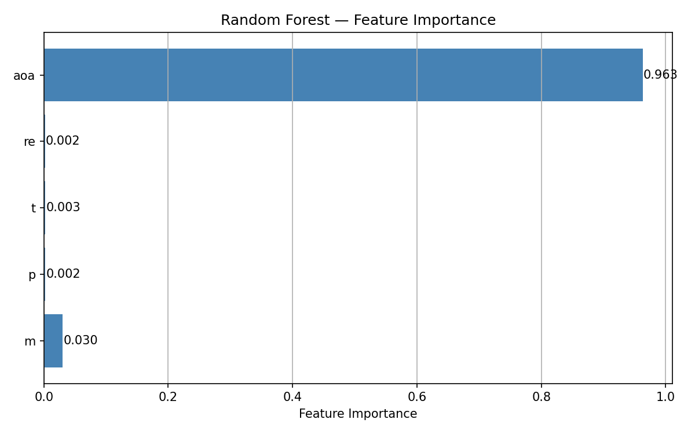
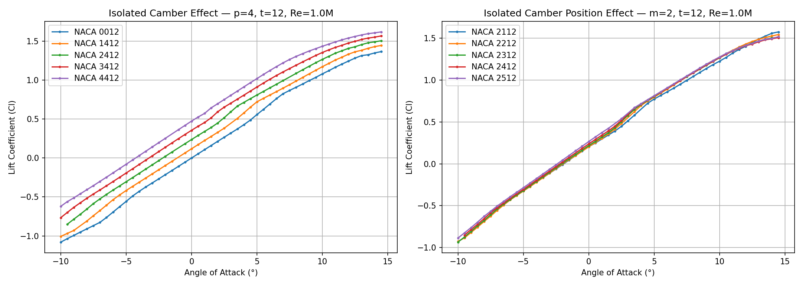

# NACA Airfoil Surrogate Model

A machine learning surrogate model that predicts aerodynamic coefficients for 
NACA 4-digit airfoils instantly — replacing slow panel-method simulations with 
a trained Random Forest model.

**[Live Demo →](https://naca-airfoil-surrogate.streamlit.app)**

---

## What is a surrogate model?

Running aerodynamic simulations (like XFoil) for thousands of airfoil designs 
is slow — each run takes seconds, and design exploration may require millions 
of evaluations. A surrogate model is a machine learning model trained on 
simulation data that can predict the same results instantly.

This project follows the same approach used in industry by companies like Airbus 
and Boeing to accelerate aerodynamic design iterations.

---

## Project overview

| Phase | Description | Output |
|---|---|---|
| Data generation | XFoil sweeps across 163 NACA 4-digit airfoils | 20,113 rows |
| EDA | Aerodynamic trend analysis | 5 insight plots |
| Surrogate model | Random Forest trained on Cl, Cd | R²=0.999 (Cl), R²=0.87 (Cd) |
| App | Interactive Streamlit dashboard | Live demo |

---

## Results

| Metric | Value |
|---|---|
| Training samples | 16,090 |
| Test samples | 4,023 |
| Cl — R² | 0.9993 |
| Cl — MAE | 0.011 |
| Cd — R² | 0.87 |
| Cd — MAE | 0.0016 |

Cl prediction is near-perfect across the full angle-of-attack range. Cd 
prediction is weaker at high AoA — expected, since drag is more sensitive 
to flow separation near stall, which is difficult to capture from geometry 
parameters alone.

---

## Visualizations

### NACA 2412 — Lift and Drag Curves

### Surrogate Model — Predicted vs Actual

### Feature Importance

### Isolated Camber Effects

---

## Key findings

- **Angle of attack** dominates prediction (feature importance: 0.963), 
  consistent with the strong nonlinear Cl/AoA relationship
- **Camber magnitude (m)** is the most important geometric parameter (0.030)
- **Camber position (p)** shows minimal influence on Cl, consistent with 
  thin airfoil theory
- Higher Reynolds numbers reduce drag significantly but have little effect 
  on lift slope

---

## Limitations

1. **NACA 4-digit only** — does not generalize to 5-digit or other airfoil families
2. **Pre-stall regime** — XFoil convergence degrades past ~14° AoA; 
   post-stall behavior is not reliable
3. **Inviscid assumptions** — XFoil is a panel method; results are less 
   accurate than RANS CFD at high AoA or low Re
4. **Cd prediction** — R²=0.87 reflects the inherent difficulty of drag 
   prediction from geometry parameters alone

---

## Stack

| Tool | Purpose |
|---|---|
| XFoil (Python wrapper) | Aerodynamic simulation |
| NumPy / Pandas | Data generation and processing |
| scikit-learn | Random Forest surrogate model |
| Matplotlib | Visualization |
| Streamlit | Interactive web app |

---

## Project structure

naca-surrogate/
├── data/                   ← XFoil dataset (20k rows)
├── notebooks/
│   ├── 01_eda.ipynb        ← Exploratory data analysis
│   └── 02_model.ipynb      ← Model training and evaluation
├── src/
│   └── generate_data.py    ← XFoil data generation script
├── app.py                  ← Streamlit app
└── requirements.txt

---

## Background

This project was built as part of a career transition from aeronautical 
engineering into simulation and data science. The domain knowledge from 
aerospace engineering (NACA airfoil theory, XFoil, boundary layer behavior) 
combined with machine learning creates a surrogate modeling pipeline — a 
technique used in real aerospace design optimization.

---

## Author

Miguel — Aeronautical Engineer building simulation and data science tools.  
[GitHub](https://github.com/miguelRepo)
